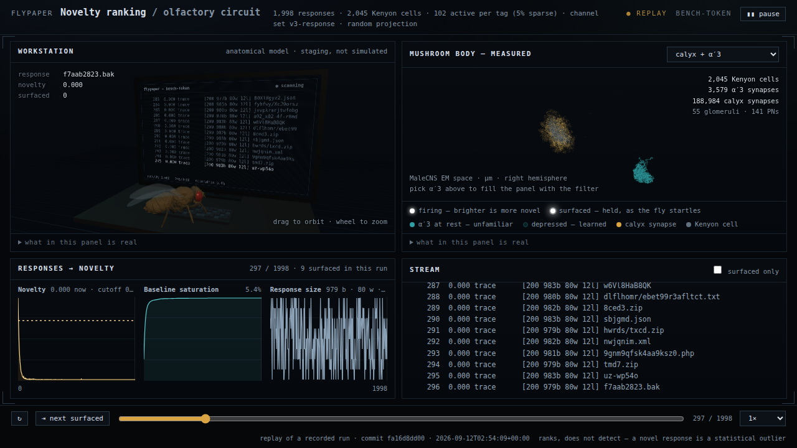

# flypaper

A novelty-ranking filter for web fuzzing output.



`fly` reads ffuf results and ranks them by how *structurally unusual* they are, replacing
hand-tuned `-fs` / `-fc` / `-fw` / `-fl` filters with a similarity-graded novelty score. The
ranking is computed by the fruit fly's olfactory circuit — a published locality-sensitive
hash and Bloom filter — optionally wired from the measured MaleCNS connectome.

**It ranks; it does not detect.** A novel response is a statistical outlier, not a
vulnerability. Output says *novel*, and nothing else.

```bash
ffuf -mc all -json -u https://target/FUZZ -w list.txt | fly rank
```

`-mc all` is deliberate: you want every response, including the 404 sea, because the noise
*is* the baseline. Filtering upstream destroys the thing the filter needs, and it fails
quietly — the ranking still looks fine. `fly rank` checks the stream and says so if it
looks pre-filtered, too short to have learned anything, or surfacing so much that the
baseline cannot be describing it.

## Install

```bash
uv tool install git+https://github.com/cauldr0nx/flyPaper     # or: pipx install
```

Pure Python; numpy and scipy at runtime, no build step. The MaleCNS tables are optional and
only needed for the connectome projection and the dashboard's geometry:

```bash
python data/fetch.py --tier core      # ~522 MB, verified against pinned SHA256
export FLYPAPER_RAW_DIR=/path/to/existing/raw && python data/fetch.py --verify-only
```

To work on it: `uv venv && uv pip install -e ".[dev]"` then `make ci` (ruff + pytest,
offline, no dataset). There is deliberately no hosted CI; `make ci` is the gate.

## Usage

```bash
# live, straight off the pipe
ffuf -mc all -json -u http://host/FUZZ -w list.txt | fly rank

# a sweep across many hosts, one baseline each — the case ffuf cannot handle
ffuf -mc all -json -u https://HOST/FUZZ -w list.txt:FUZZ -w hosts.txt:HOST | fly rank --per host

# one host serving several kinds of page — a baseline per kind, not one for all of them
ffuf -mc all -json -u http://host/FUZZ -w list.txt | fly rank --per shape

# a completed run, scored in two passes, showing the most novel half-percent
fly rank results.json --percentile 99.5

# monitoring: what is structurally new on this target since last time
fly rank results.json --baseline acme --per host --decay-halflife 604800
fly watch newscan.json --baseline acme --per host

# stage two: re-fetch the most novel candidates, scope-gated and slow
fly taste results.json --scope scope.txt --top 10
```

There is no novelty threshold to choose, and a fixed one cannot work: baseline noise sits at
0.000 on every surface measured, but the weakest genuine result ranged from 0.001 to 0.318
across them. The cutoff is a review budget instead — `--percentile 99.5` shows the most
novel half-percent *for this target*, calibrated from the run itself.

`fly watch` reports **structurally** new, not newly-seen: a new URL serving a page much like
one the target already had is not flagged. That is right for monitoring at scale and wrong
if what you wanted was a URL diff.

The dashboard above is `python -m flypaper.web.export` then
`python -m flypaper.web.server`, and needs the MaleCNS tables for its geometry. Given a
scope file and a directory of wordlists it can also start a scan and rank it as it arrives:

```bash
python -m flypaper.web.server --scope scope.txt --wordlist-dir ~/wordlists
```

This is the only place flypaper initiates a request. Everything deciding *what may be
scanned* is fixed before the browser exists — the scope file and the wordlist directory are
named on that command line, the rate ceiling is in the code, and ffuf is run as an argv list
rather than through a shell. The page can pick from those; it cannot widen them. Without
both flags the dashboard replays and ranks and cannot scan at all.

Every claim this project makes is produced by a benchmark in `bench/` into a report in
`reports/`, including the ones that came out against it — and most of the connectome ones
did. The latest is [reports/readout.md](reports/readout.md): the measured MBON-α′3 reads
345 of 2,045 Kenyon cells, and a filter that small is worse at this job than the published
one that reads all of them.

## Known limitations

**Baseline poisoning.** An attacker who floods benign-looking variants first makes them
familiar, letting a real payload ride in below threshold. Temporal decay partly mitigates
this — waiting makes things *more* novel, not less — but the real evasion is staying under
the encoder's resolution, and nothing in the design prevents that. If you are ranking
output from a target that knows it is being ranked, this is the hole.

**Encoder sensitivity.** Results depend entirely on the channel set. The neural code is
comparatively simple; the encoder is where all the skill lives, and a poor one degrades the
whole system to noise. Every baseline records the channel-set version that built it and
refuses to load under a different one, and every ranked record names that version, because
comparing scores across channel sets is meaningless.

**Ranking, not detection.** Restated because it matters: a high novelty score means *this
response is unlike the others*, which is not the same as *this response is interesting*,
and is much further still from *this response is a vulnerability*. The tool reorders a
review queue. A human does the reviewing.

## Authorization

**The `fly` CLI never initiates a request in stage one** — it reads results the operator
already generated. Stage-two re-fetch re-requests only URLs already present in the input
stream, under a mandatory explicit `--scope` file, rate-limited: no crawling, no guessing,
no following a redirect to a new host, no implicit same-domain inference, no wildcard
default. Response bodies are not stored by default.

**The dashboard is the exception, and it is opt-in twice.** Started with `--scope` and
`--wordlist-dir` it can launch a scan, because a dashboard that can only replay yesterday's
capture is a viewer rather than an instrument. What the page may choose is bounded by those
two flags and by a rate ceiling in the code; it cannot name a host outside the scope file, a
path outside the wordlist directory, or a rate above the ceiling, and ffuf is executed as an
argv list so a target is never a command. State-changing requests carry a per-process token
injected into the page, which a site on another origin cannot read — without it, any page
the operator happened to visit could drive a scanner listening on their loopback interface.

None of that makes it safe to point at a host you are not authorised against. It makes it
hard to do so by accident, and impossible to do so from the page alone.

## Licenses

This repository is MIT. Several things it depends on, cites or runs against are not, and
the MaleCNS data carries its own terms regardless of our code license. The full audit is in
[reports/licenses.md](reports/licenses.md); the matrix below is enforced by
`tests/test_licenses.py`.

<!-- LICENSE-MATRIX-START -->

| Component | Role | License | Handling |
|---|---|---|---|
| flypaper (this repository) | the tool | MIT | — |
| [ffuf](https://github.com/ffuf/ffuf) (Joona Hoikkala and contributors) | produces the input we read | MIT | Not vendored, not forked. Invoked by the operator; cited. |
| [ffufme](https://github.com/BuildHackSecure/ffufme) (Adam Langley) | local practice target for the replay corpus | No license file published | Built and run locally as a target only. Source never vendored, never redistributed. Captured corpora hold metadata, never response bodies, and are never committed. |
| [ffufPostprocessing](https://github.com/dsecuredcom/ffufPostprocessing) (dsecuredcom) | closest prior art — strips dynamic content before filtering | No license file published | Cited as prior art. No code reuse. |
| [ffufw](https://github.com/puzzlepeaches/ffufw) (puzzlepeaches) | wrapper; source of feature ideas | No license file published | Cited as prior art. No code reuse. |
| [FFUF-Workflow-Tool](https://github.com/nullenc0de/FFUF-Workflow-Tool) (nullenc0de) | evidence for the pipe-not-fork architecture | No license file published | Cited as prior art. No code reuse. |
| MaleCNS v1.0 connectome data | the measured PN→KC wiring | CC BY 4.0 | Governs the data regardless of this repository's MIT license. Verbatim terms and attribution in `data/manifest.json`. The tables themselves are never committed. One **derived** summary is: `flypaper/brain/claw-degrees.json`, a 13-number histogram of how many glomeruli each Kenyon cell listens to, which CC BY permits with attribution and which is what `--projection degree-sampled` needs instead of the 508 MB download. |
| [fly_connectome_data_tutorial](https://github.com/sjcabs/fly_connectome_data_tutorial) (sjcabs) | orientation material | MIT | Read for method. |
| [philshiu/Drosophila_brain_model](https://github.com/philshiu/Drosophila_brain_model) | whole-brain LIF model | MIT | Verified 2026-09-11 — the brief recorded this as unverified. Read for method. |
| [eonsystemspbc/fly-brain](https://github.com/eonsystemspbc/fly-brain) | adjacent implementation | GPL-2.0-or-later | **Excluded.** Never vendored, never copied into this MIT repository. |
| flyDash (same author) | source of the MaleCNS fetch and load pipeline, and the dashboard's fly mesh | MIT | Ported with attribution in each ported module's docstring. |
| [three.js](https://github.com/mrdoob/three.js) | 3D rendering in the dashboard | MIT | **Vendored** at `flypaper/web/static/three.module.js` so the dashboard works offline. Copyright notice retained in the file. |
| [NeuroMechFly v2](https://github.com/NeLy-EPFL/flygym) (Lobato-Rios et al., *Nature Methods* 2024) | the anatomical fly body in the dashboard | Apache-2.0 | **Vendored** as a quantised mesh at `flypaper/web/static/fly.bin`. Shown as staging only: not simulated, and not spatially registered to the connectome. |
| [MNIST](https://yann.lecun.com/exdb/mnist/) (LeCun & Cortes) | M3 benchmark dataset | CC BY-SA 3.0 | Fetched on demand to `data/benchmarks/`, never committed. |
| [Fashion-MNIST](https://github.com/zalandoresearch/fashion-mnist) (Zalando SE) | M3 benchmark dataset | MIT | Fetched on demand to `data/benchmarks/`, never committed. |

| Package | License |
|---|---|
| numpy | BSD-3-Clause |
| scipy | BSD-3-Clause |
| pandas | BSD-3-Clause |
| pyarrow | Apache-2.0 |
| requests | Apache-2.0 |
| PyYAML | MIT |
| pytest | MIT |
| ruff | MIT |
| hatchling | MIT |

<!-- LICENSE-MATRIX-END -->

The Male CNS dataset is licensed under CC-BY. See
<https://creativecommons.org/licenses/by/4.0/>.

## Citations

| Result | Citation |
|---|---|
| FlyHash / olfactory locality-sensitive hashing | Dasgupta, Stevens & Navlakha, *Science* 358(6364):793–796, 2017 |
| Fly Bloom Filter / novelty detection | Dasgupta, Sheehan, Stevens & Navlakha, *PNAS* 115(51):13093–13098, 2018 |
| MaleCNS connectome | Berg et al., *Cell*, 2026 — doi:10.1016/j.cell.2026.08.015 |
| Whole-brain LIF model | Shiu et al., *Nature* 634:210–219, 2024 |

## Credits

ffuf is by Joona Hoikkala (@joohoi) and contributors. ffufme is by Adam Langley.
ffufPostprocessing is by dsecuredcom. The MaleCNS reconstruction is a collaboration between
FlyEM (HHMI Janelia), the University of Cambridge (Dept. of Zoology), the MRC Laboratory of
Molecular Biology, and Google Research.
